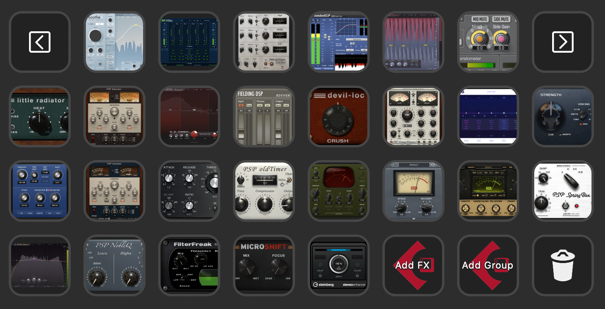
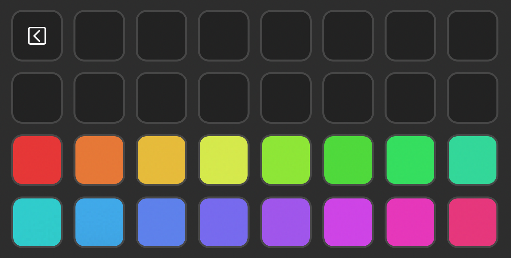
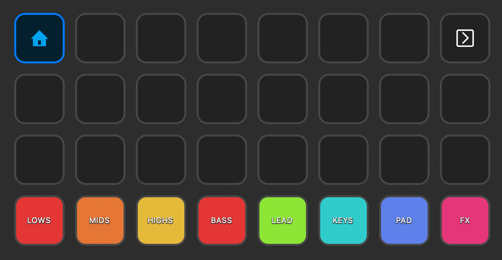

# Cubase Automation Pack
My collection of Stream Deck profiles and Keyboard Maestro scripts for Steinberg Cubase task automation.

## Prerequisites
- Steingberg Cubase: https://www.steinberg.net/cubase 🙃
- Stream Deck Device or Stream Deck Mobile: https://www.elgato.com/en/stream-deck
- KMlink Plugin: https://github.com/Corcules/KMlink
- Stream Deck Cubase Plugin: https://trevligaspel.se/streamdeck/cubase/index.html
- Keyboard Maestro: https://www.keyboardmaestro.com/main/

## How to use
- import `Cubase.streamDeckProfile` to the Stram Deck app
- import `Cubase Macros.kmmacros` to the Keyboard Maestro
- copy `Project Logical Editor Scripts` files into `~/Documents/Steinberg/Cubase/User Presets/Project Logical Editor/`
- set keycommands for `Color[01-16]` and edit keystrokes in Keyboard Maestro macro `Color Selected Channels` action `Set Tracks Color`
- ...

## What's inside?
- Add plugin at insert under mouse pointer

- Remove plugin at insert under mouse pointer
- Color tracks

- Color tracks and change output

- ....

## To be continued...

## Buy me a coffee ☕️
👉 https://www.buymeacoffee.com/pfigielmusic
